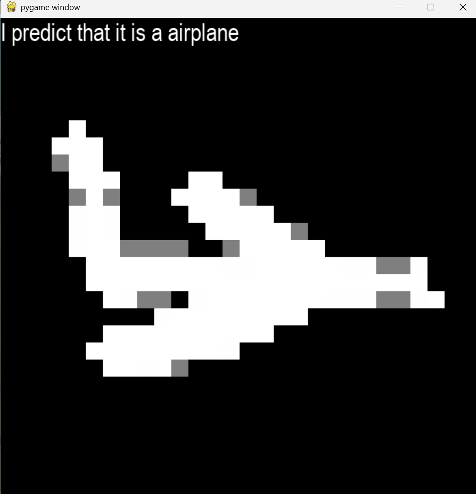
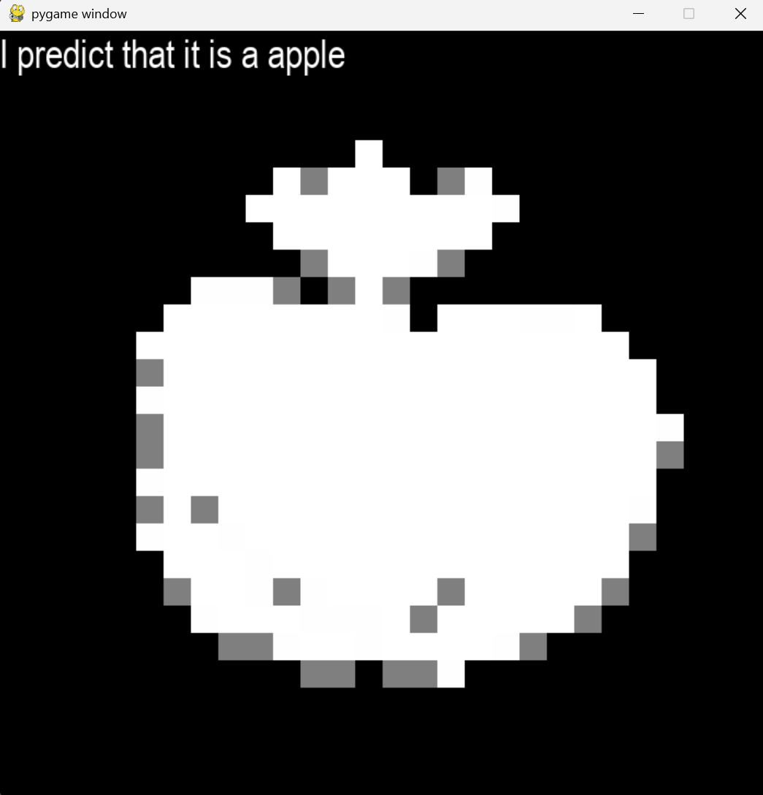
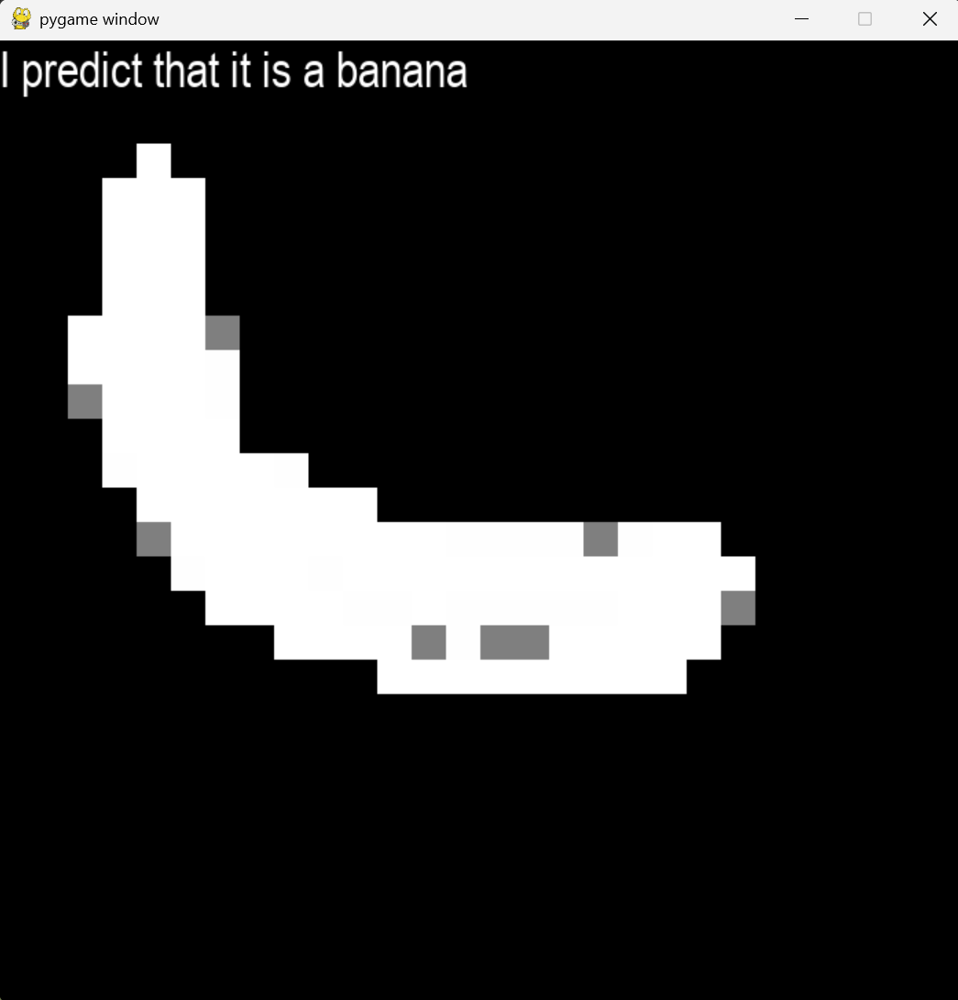
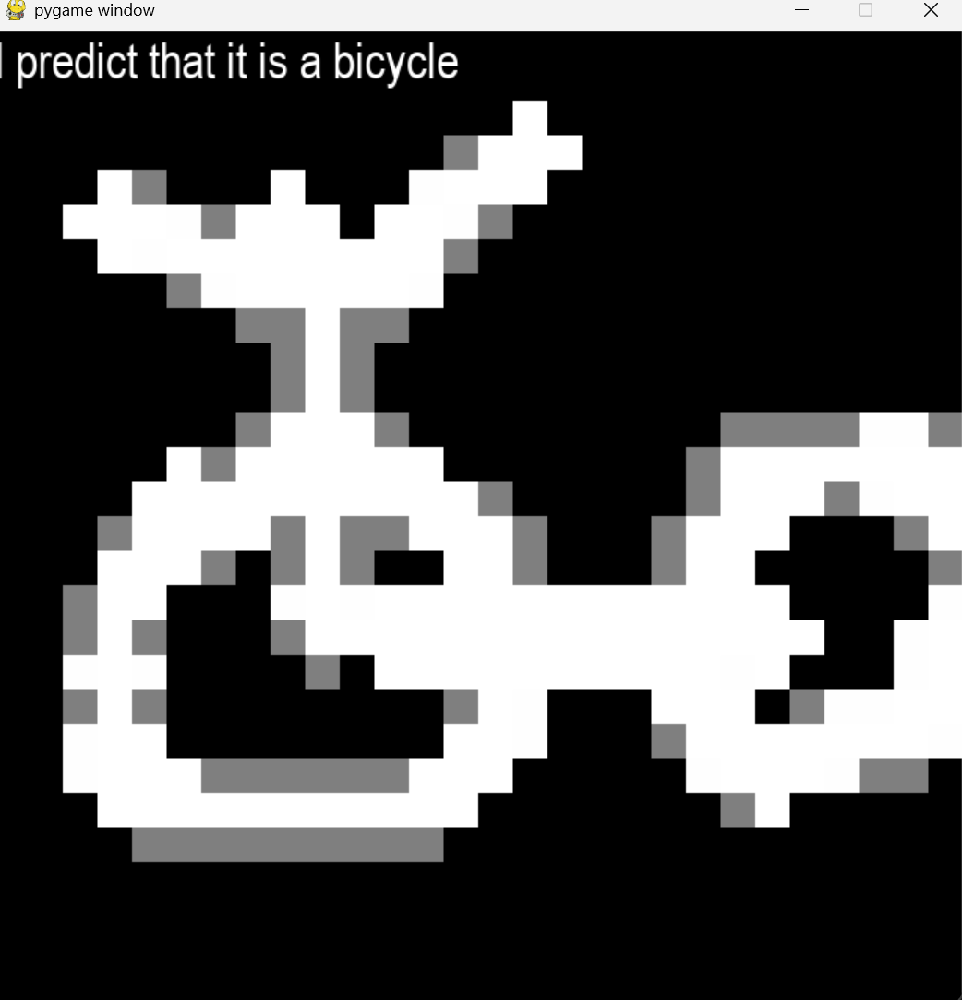

# Quick Draw CNN Classifier

## Overview

This project is a real-time drawing recognition system built using a Convolutional Neural Network (CNN) in PyTorch. It is trained on the Quick, Draw! dataset and allows users to draw sketches on a pygame canvas while the model predicts the object being drawn in real time.

The system combines:
- A CNN trained on multiple sketch categories
- A custom pygame drawing interface
- Real-time inference on user input drawings

## Features

- CNN-based image classification model
- Trained on Quick, Draw! numpy dataset
- Supports multiple object categories
- Real-time drawing interface using pygame
- Live prediction updates during drawing
- Simple grayscale input (28x28 resolution)

## Model Architecture

The model is a convolutional neural network:

- Conv2D (1 → 8 filters, 3x3 kernel, padding=1)
- ReLU
- MaxPool2D
- Conv2D (8 → 16 filters, 3x3 kernel, padding=1)
- ReLU
- MaxPool2D
- Flatten
- Linear (16 × 7 × 7 → 64)
- ReLU
- Linear (64 → number of classes)

Loss function:
- CrossEntropyLoss

Optimizer:
- Adam

## Dataset

The model uses the Quick, Draw! dataset stored as numpy arrays.

Each category file contains stroke-based sketches converted into 28x28 grayscale images.

Categories used:
- airplane
- apple
- bicycle
- broom
- banana
- bed
- basket
- baseball
- axe
- angel
- alarm clock
- ambulance

Data processing:
- Normalized to [0, 1]
- Reshaped to (1, 28, 28)
- Split into training and testing sets

## How It Works

1. CNN is trained on labeled sketch data
2. Pygame window opens a drawable canvas
3. User draws using mouse input
4. Drawing is converted into a tensor
5. Model predicts the category
6. Prediction is displayed on screen

## Running the Project

### Install dependencies
```python
pip install torch pygame
```
###Example








